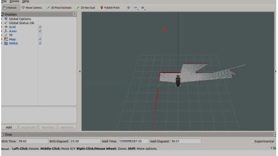
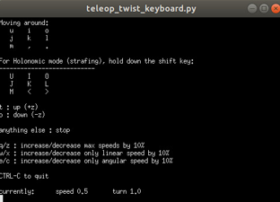
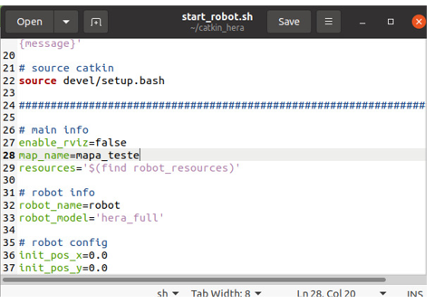
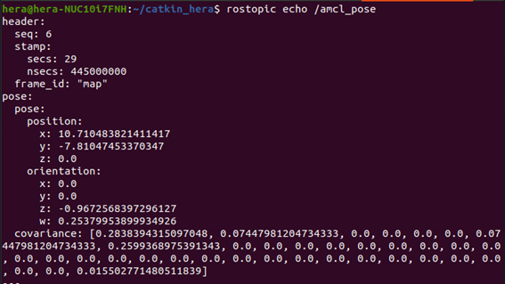
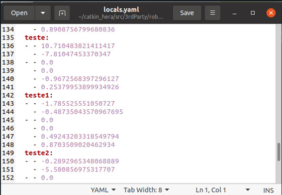
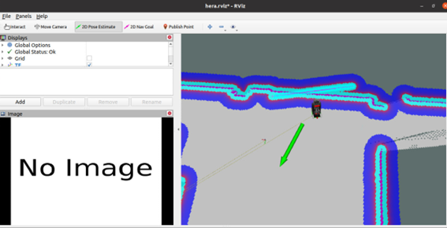
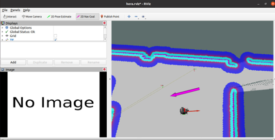

# Navigation Tutorials


**1- Create a new map:**

- Open terminal catkin and put the following command:

    ```bash    
    cd catkin hera
    ```
- start the devices of the robot:
    ```bash
    ./start_devices.sh
    ```
- On another terminal, run launch mapping:

    ```bash    
    roslaunch hera bringup_mapping.launch
    ```
- After that, a rviz page will open. It’s necessary to circle with the robot in the local that you want to map. It’s also necessary to slow the robot to get a good mapping.





- After mapping the map, open another terminal and search using the following command to the folder where the other maps are.

    ```bash
    cd src/3rdParty/robot_resources/map
    ```
- Create a folder to save the map that was generated the map.
mkdir mapa_teste
cd mapa_teste
- Save the map that was generated with the following command:
rosrun map_server map_saver
- To use the map that was created it’s necessary to open the file start_robot.sh on catkin and change the name of the map. The line to change the name is the 28th.



**2- Saving local**

- To save a location on the map, position the robot in the desired location. After that, open the HERA bot in Telegram and send the save command with location name:
```bash
/savelocal teste
```


**3- If telegram doesn’t work**

- Print the position topic in the terminal
```bash
rostopic echo /amcl_pose
```
- In the folder /src/3rdParty/robot_resources/map open the folder with the map used and edit the locals.yaml file adding the name of the location and the positions displayed in the terminal





**4-Autonomous Navigation**

- Start the robot and the interface using the following commands:
```bash
cd catkin_hera
./start_devices.sh
```
```bash
./start_robot.sh
```
```bash
./start_interface.sh
```
- With the rviz open use the 2d pose Estimate to locate the robot on the map



- Then use the 2d Nav Goal to inform the position to where the robot should move autonomously.


